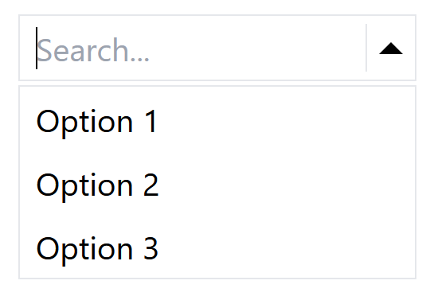
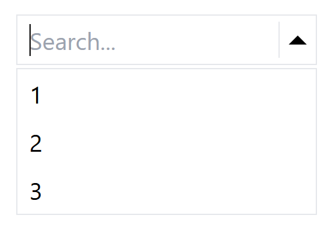
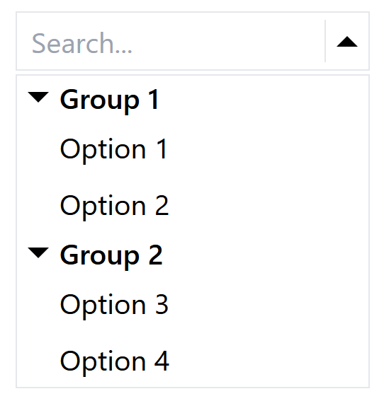
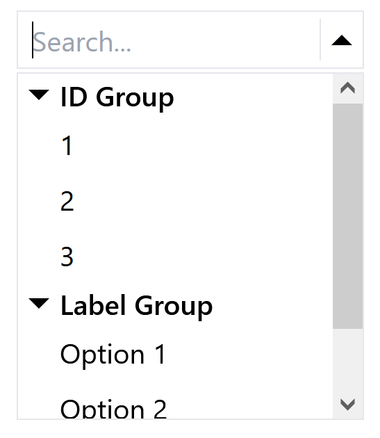

### Documentation

#### ASelect Component

The `ASelect` component is a customizable dropdown select component for React applications.

### Installation

To install `ASelect` in your project, you can use npm:

```bash
npm install ASelect
```

Or yarn:

```bash
yarn add ASelect
```

### Usage

#### Importing

```javascript
import { ASelect } from "ASelect";
```

#### Basic Usage

```javascript
<ASelect
  value={value}
  options={["Option 1", "Option 2", "Option 3"]}
  onChange={(selectedOption, selectedOptionObject, currentSearchString) =>
    setValue(selectedOption)
  }
/>
```

##### Output


#### Example with Array of Objects (with keyProp)

```javascript
<ASelect
  value={value}
  options={[
    { id: 1, label: "Option 1" },
    { id: 2, label: "Option 2" },
    { id: 3, label: "Option 3" },
  ]}
  keyProp="label"
  onChange={(selectedOption, selectedOptionObject, currentSearchString) => {
    setValue(selectedOption);
    setCurrentObject(selectedOptionObject);
  }}
/>
```

##### Output 1 (keyProp="label")


##### Output 2 (keyProp="id")


#### Basic Example with Grouped Options

```javascript
<ASelect
  value={value}
  options={[
    {
      groupName: "Group 1",
      options: ["Option 1", "Option 2"],
    },
    {
      groupName: "Group 2",
      options: ["Option 3", "Option 4"],
    },
  ]}
  onChange={(selectedOption, selectedOptionObject, currentSearchString) =>
    setValue(selectedOption)
  }
/>
```

##### Output


#### Advanced Example with Grouped Options

```javascript
<ASelect
  value={value}
  options={[
    {
      groupName: "ID Group",
      options: [
        { id: 1, label: "Option 1" },
        { id: 2, label: "Option 2" },
        { id: 3, label: "Option 3" },
      ],
      keyProp: "id",
    },
    {
      groupName: "Label Group",
      options: [
        { id: 1, label: "Option 1" },
        { id: 2, label: "Option 2" },
        { id: 3, label: "Option 3" },
      ],
      keyProp: "label",
    },
  ]}
  onChange={(selectedOption, selectedOptionObject, currentSearchString) =>
    setValue(selectedOption)
  }
/>
```

##### Output


### Props

| Prop        | Type                                                              | Default     | Description                                                                                                       |
| ----------- | ----------------------------------------------------------------- | ----------- | ----------------------------------------------------------------------------------------------------------------- |
| value       | string                                                            |             | The currently selected value.                                                                                     |
| onChange    | (selectedOption, selectedOptionObject, currentSearchString) => {} |             | Callback function invoked when a new value is selected.                                                           |
| options     | array                                                             |             | List of options to display in the dropdown.                                                                       |
| keyProp     | string                                                            |             | Property to be used as a key within the objects of the options list. Mandatory if options is an array of objects. |
| searchable  | boolean                                                           | true        | Boolean indicating if the dropdown is searchable.                                                                 |
| placeholder | string                                                            | "Search..." | Placeholder text for the input field.                                                                             |
| disabled    | boolean                                                           |             | Disables the select component.                                                                                    |
| width       | string or number                                                  |             | Width of the select component.                                                                                    |
| zIndex      | number                                                            | 1           | z-index for the dropdown.                                                                                         |
| fontSize    | number                                                            | 16          | Font size for the select component.                                                                               |
| required    | boolean                                                           | false       | Indicates whether the select component is required.                                                               |

### Conclusion

With the `ASelect` component, you can easily add customizable dropdown select functionality to your React applications. Choose from a variety of options including array of strings, array of objects with keyProp, and grouped options to suit your needs. Follow the documentation to install and use the component in your project for testing and development purposes.
